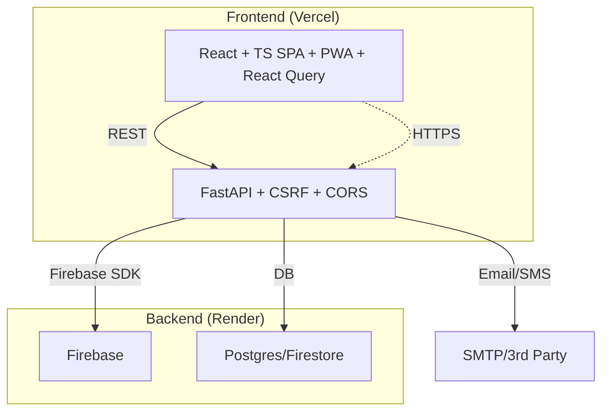
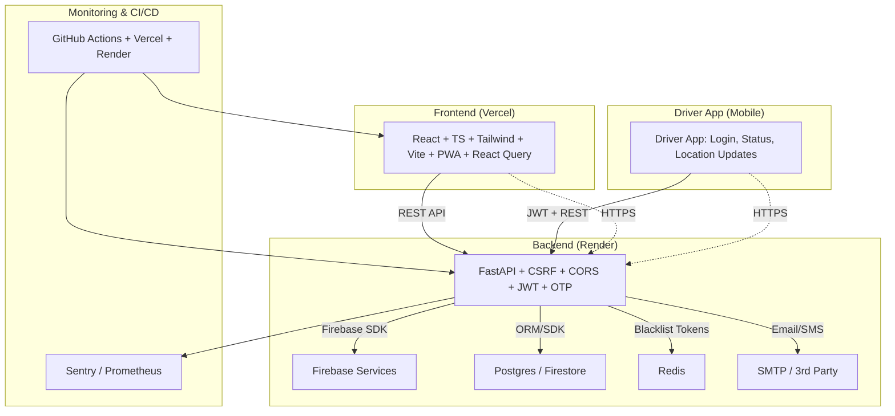

# YatraOne (Smart Bus Platform)


---


## 🚍 Project Overview
A modern, secure, and scalable public transport management platform. Features include:
- Real-time bus tracking
- User registration/login with OTP & JWT
- Admin dashboard & analytics
- Feedback, lost & found, rewards, notifications
- Progressive Web App (PWA) support for offline/low-bandwidth use
- React Query for API caching and performance
- Config/constants files for maintainability
- Advanced security: HTTPS, JWT refresh, CSRF, CORS whitelist, rate limiting, password policy
- **Driver App:**
  - Secure login/signup, JWT, userId
  - Online/offline toggle for driver status
  - Real-time location updates (manual/auto)
  - Assigned bus info, error/status feedback
  - Only allows updates when online and assigned

## 🏗️ Architecture



## 🛠️ Tech Stack
| Layer      | Tech                                    |
|------------|-----------------------------------------|
| Frontend   | React, TypeScript, Tailwind, Vite, PWA, React Query |
| Backend    | FastAPI, Python, Firebase, Pydantic, CSRF, CORS     |
| Auth       | JWT, OTP, bcrypt, python-jose           |
| DB         | Firebase, (optionally Postgres/Firestore)|
| Monitoring | Sentry, Prometheus (optional)           |
| CI/CD      | GitHub Actions, Vercel, Render          |

## 🚀 Setup Guide
### 1. Clone & Install
```sh
git clone https://github.com/your-org/your-repo.git
cd your-repo
```

### 2. Environment Variables
#### Frontend (`frontend/.env`)
```env
VITE_API_URL=http://localhost:10000/api
VITE_FIREBASE_API_KEY=...
VITE_FIREBASE_AUTH_DOMAIN=...
VITE_FIREBASE_DATABASE_URL=...
VITE_FIREBASE_PROJECT_ID=...
VITE_FIREBASE_STORAGE_BUCKET=...
VITE_FIREBASE_MESSAGING_SENDER_ID=...
VITE_FIREBASE_APP_ID=...
```
#### Backend (`backend/.env`)
```env
FIREBASE_KEY=backend/serviceAccountKey.json
JWT_SECRET=your-secret
ACCESS_TOKEN_EXPIRE_MINUTES=30
REFRESH_TOKEN_EXPIRE_DAYS=7
RATE_LIMIT=100/minute
ALLOWED_ORIGINS=*
```

### 3. Run Locally
```sh
# Backend
cd backend
pip install -r requirements.txt
uvicorn app.main:app --reload
# Frontend
cd ../frontend
npm install
npm run dev
```

## 🚢 Deployment
- **Staging:** Use separate `.env` and DB for staging. Deploy backend to Render, frontend to Vercel.
- **Production:** Use strong secrets, HTTPS enforced by Vercel/Render, monitoring enabled.

## 🔒 Security
- JWT access/refresh, blacklist, and rotation
- HTTPS everywhere (Vercel/Render SSL termination)
- Rate limiting (slowapi)
- Password policy (backend)
- Audit logging

## ⚙️ CI/CD
- GitHub Actions: Lint, test, build, deploy
- Vercel: Auto-deploy frontend on push
- Render: Auto-deploy backend on push

## 🤝 Contributing
- Branch: `main` (prod), `dev` (feature/dev)
- PRs: Descriptive titles, link issues, use conventional commits
- Code: Add docstrings/comments, keep code clean


## 🗂️ Docs
- [backend/README.md](backend/README.md)
- [frontend/README.md](frontend/README.md)
- [driver_app/README.md](driver_app/README.md)
- [ONBOARDING.md](ONBOARDING.md)
- [CHANGELOG.md](CHANGELOG.md)
- [SIH_Documentation.md](SIH_Documentation.md)

---


## 📊 Architecture Diagram

