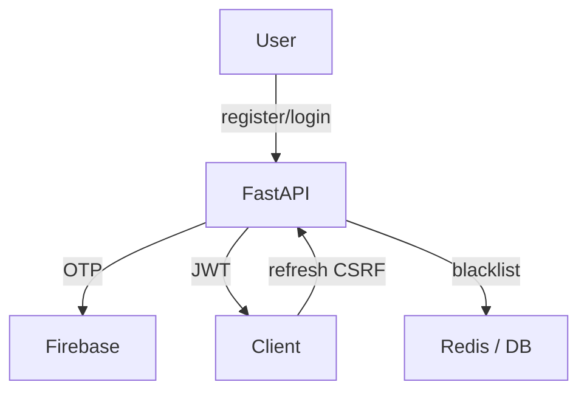
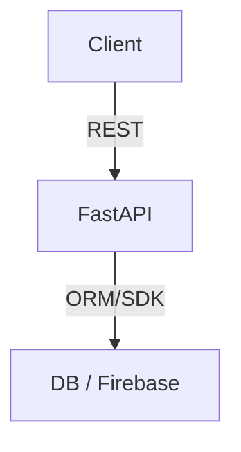

# Security & Secret Management

**Never commit real secrets or .env files to version control.**

- Use `.env.example` as a template and keep your real `.env` files out of git (see `.gitignore`).
- For production, use a secret manager (AWS Secrets Manager, Azure Key Vault, GCP Secret Manager, etc.) or environment variables to inject secrets at runtime.
- Rotate secrets regularly and restrict access to only trusted team members.
- Never store service account keys or passwords in the codebase.

**Example: Setting secrets in production (Linux)**
```sh
export SECRET_KEY=your-secret
export FIREBASE_SERVICE_ACCOUNT=/path/to/serviceAccountKey.json
# ...
```

**Recommended Reading:**
- https://12factor.net/config
- https://cheatsheetseries.owasp.org/cheatsheets/Secrets_Management_Cheat_Sheet.html

# Backend Documentation

## Overview
The backend is a FastAPI application providing authentication (OTP, JWT, CSRF), user management, analytics, and admin APIs. It integrates with Firebase for OTP/email and uses JWT for secure session management. Now includes:
- CSRF protection for refresh token endpoints
- CORS whitelist for trusted origins
- Pydantic validation for all incoming requests
- Centralized config/constants for maintainability
- Reference to [SIH_Documentation.md](../SIH_Documentation.md) for Smart India Hackathon submission
# Backend Documentation

## Overview
The backend is a FastAPI application providing authentication (OTP, JWT), user management, analytics, and admin APIs. It integrates with Firebase for OTP/email and uses JWT for secure session management.

## Folder Structure
```text
backend/
├── app/
│   ├── __init__.py
│   ├── main.py           # FastAPI app entrypoint
│   ├── firebase.py       # Firebase integration
│   ├── email_utils.py    # Email/OTP helpers
│   ├── models/           # Pydantic models
│   ├── routes/           # API routes
│   ├── services/         # Business logic
│   ├── utils/            # Auth, JWT, password, CSRF, CORS, etc.
│   └── email_templates/  # HTML email templates
├── config.py             # Centralized config/constants
├── requirements.txt
├── serviceAccountKey.json
├── .env.example
└── README.md
```

## Modules
### models/
- **user.py**: User schema, registration/login fields
- **feedback.py**: Feedback schema

### routes/
- **auth.py**: `/auth` endpoints (register, login, OTP, refresh, logout)
- **users.py**: User CRUD, profile, settings
- **buses.py**: Bus CRUD, assignment
- **feedback.py**: Feedback endpoints
- ...see code for all routes

### services/
- **user_service.py**: User business logic

### utils/
- **auth.py**: Password hashing, JWT helpers
- **jwt_utils.py**: JWT encode/decode, expiry, blacklist
- **password_policy.py**: Password validation
- **audit_log.py**: Security/audit logging


## API Reference
### Auth Endpoints
| Endpoint         | Method | Description                |
|------------------|--------|----------------------------|
| /auth/register   | POST   | Register new user (OTP)    |
| /auth/login      | POST   | Login, returns JWT         |
| /auth/send-otp   | POST   | Send OTP to email          |
| /auth/verify-otp | POST   | Verify OTP for user        |
| /auth/refresh-token | POST| Refresh JWT access token (CSRF protected) |
| /auth/logout     | POST   | Blacklist refresh token    |

#### Example: Register (curl)
```sh
curl -X POST http://localhost:10000/api/auth/register \
  -H 'Content-Type: application/json' \
  -d '{"email":"user@example.com","password":"...","otp":"123456"}'
```

#### Example: Login (axios)
```js
await axios.post('/auth/login', { email, password });
```

#### Error Codes
| Code | Meaning                |
|------|------------------------|
| 400  | Bad request/validation |
| 401  | Unauthorized           |
| 403  | Forbidden/CSRF failed  |
| 409  | Conflict (user exists) |
| 429  | Rate limit exceeded    |


## Security
- JWT access/refresh, blacklist, rotation
- CSRF protection for refresh token endpoint
- CORS whitelist for trusted origins
- Rate limiting (slowapi)
- HTTPS redirect (prod)
- Password policy (min length, complexity)
- Audit logging


## Env Vars
| Key                        | Purpose                        |
|----------------------------|--------------------------------|
| FIREBASE_KEY               | Path to Firebase service key   |
| JWT_SECRET                 | JWT signing secret             |
| ACCESS_TOKEN_EXPIRE_MINUTES| Access token expiry (minutes)  |
| REFRESH_TOKEN_EXPIRE_DAYS  | Refresh token expiry (days)    |
| RATE_LIMIT                 | API rate limit (e.g. 100/min)  |
| ALLOWED_ORIGINS            | CORS allowed origins           |
| CSRF_ENABLED               | Enable CSRF protection         |

## Testing
```sh
pytest
```


## Diagrams
### Auth Flow


### Data Flow


## SIH Documentation
See [../SIH_Documentation.md](../SIH_Documentation.md) for full project overview, architecture, and evaluation.
